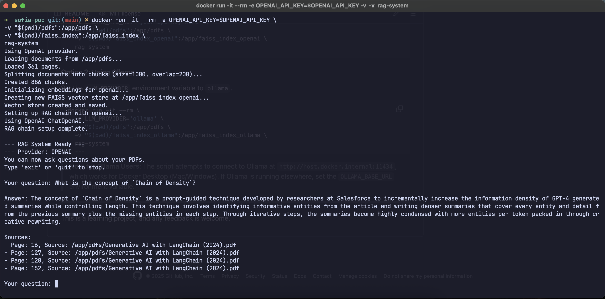

# Sofia-PoC: A Humble RAG System Proof of Concept

This project is a simple Proof of Concept (PoC) for a Retrieval-Augmented Generation (RAG) system built with LangChain. The main goal is to provide a straightforward, containerized RAG that can answer questions based on a local collection of documents.

This system was designed with a **Docker-first approach**. The entire application is intended to be built and run as a Docker container. This simplifies setup by handling all dependencies and ensuring a consistent environment, allowing you to get started quickly without complex local configuration.

## Features

*   **Question-Answering**: Ask questions in natural language about your documents.
*   **Multi-Document Support**: Ingests both PDF (`.pdf`) and Markdown (`.md`) files.
*   **Switchable LLM Providers**: Easily switch between the **OpenAI API** and a local **Ollama** instance by setting an environment variable at runtime.
*   **Persistent Vector Store**: Saves document embeddings to a local directory (`faiss_index_*`) so you don't have to re-process files every time you start the container.

## Getting Started

### Prerequisites

*   [Docker](https://www.docker.com/get-started) installed and running.
*   An **OpenAI API Key** (if using the OpenAI provider).
*   [Ollama](https://ollama.ai/) installed with a model pulled (e.g., `ollama pull llama2`) if using the Ollama provider.

### Setup

1.  **Clone the Repository**:
    ```bash
    git clone https://github.com/castrovroberto/sofia-poc
    cd sofia-poc
    ```

2.  **Add Documents**:
    Place your `.pdf` and `.md` files into the `pdfs/` directory.

3.  **Build the Docker Image**:
    This command builds the container image and installs all dependencies.
    ```bash
    docker build -t rag-system .
    ```

### How to Run

The system is configured via environment variables when you launch the container.

#### Option 1: Using OpenAI (Default)

Replace `'your-super-secret-api-key'` with your actual OpenAI API key.

```bash
docker run -it --rm \
  -e OPENAI_API_KEY='your-super-secret-api-key' \
  -v "$(pwd)/pdfs":/app/pdfs \
  -v "$(pwd)/faiss_index_openai":/app/faiss_index_openai \
  rag-system
```

#### Option 2: Using Ollama

Set the `LLM_PROVIDER` environment variable to `ollama`.

```bash
docker run -it --rm \
  -e LLM_PROVIDER='ollama' \
  -v "$(pwd)/pdfs":/app/pdfs \
  -v "$(pwd)/faiss_index_ollama":/app/faiss_index_ollama \
  rag-system
```
> **Note for Ollama Users**: The script attempts to connect to Ollama at `http://host.docker.internal:11434`, which works for Docker Desktop (Mac/Windows). If Ollama is running elsewhere, set the `OLLAMA_BASE_URL` environment variable.

---

This is a learning project, and any feedback is welcome.

## Example

Here is an example of the system in action, answering a question about the "Chain of Density" concept:


